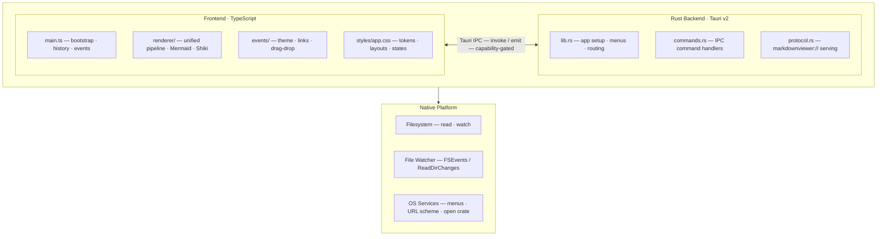
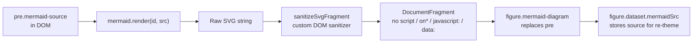
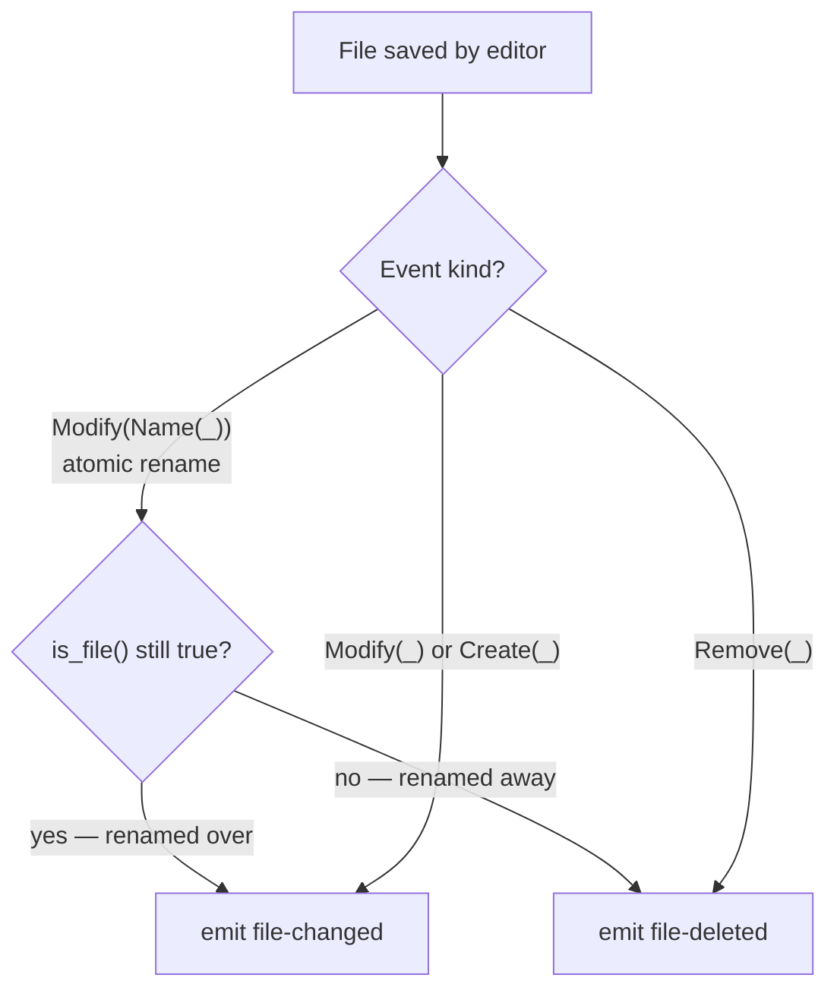
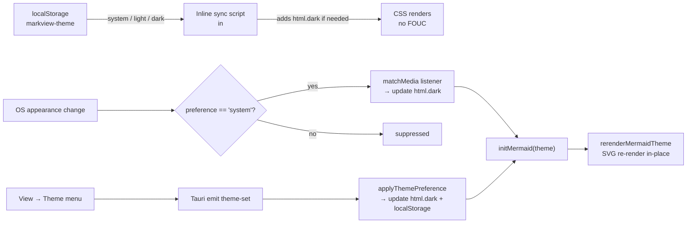

# MarkdownViewer — Technical Architecture

For mid-level engineers contributing to or evaluating the codebase. Covers the system design, all major technology choices and their rationale, security model, and implementation details.

---

## Contents

1. [System Overview](#system-overview)
2. [Source Layout](#source-layout)
3. [Key Architectural Decisions — Quick Reference](#key-architectural-decisions--quick-reference)
4. [Tauri v2 Plugin Manifest](#tauri-v2-plugin-manifest)
5. [Technology Decisions](#technology-decisions)
   - [Framework: Tauri v2](#framework-tauri-v2)
   - [Markdown Parser: remark/unified](#markdown-parser-remarkunified)
   - [Syntax Highlighter: Shiki](#syntax-highlighter-shiki)
   - [Diagram Renderer: Mermaid.js](#diagram-renderer-mermaidjs)
   - [Plugin Bundle Architecture](#plugin-bundle-architecture)
   - [Product Scope (v1)](#product-scope-v1)
   - [Cross-platform Strategy](#cross-platform-strategy)
   - [File-write IPC Design](#file-write-ipc-design)
6. [Rendering Pipeline](#rendering-pipeline)
7. [Mermaid Rendering](#mermaid-rendering)
8. [Security Model](#security-model)
9. [IPC Command Reference](#ipc-command-reference)
10. [File Watching](#file-watching)
11. [Theme System](#theme-system)
12. [Navigation History](#navigation-history)

---

## System Overview

MarkdownViewer is a native desktop app built on Tauri v2: a **Rust backend** that handles all I/O and security, and a **TypeScript/HTML/CSS frontend** running in the OS-native WebView (WKWebView on macOS, WebView2 on Windows). The two halves communicate exclusively via typed Tauri IPC commands — the frontend has no direct filesystem access.



**Key properties:**

- The frontend has no direct filesystem access — all reads go through `read_file` / `watch_file` Tauri commands
- Every path received from the frontend is re-validated in Rust before use (`canonical_markdown_path`)
- The WebView's CSP prevents arbitrary network requests and script injection
- The unified processor is frozen at module load — rendering is stateless and safe to call from any event handler

---

## Source Layout

| Path | Contents |
|---|---|
| `ui/main.ts` | App bootstrap, event listeners, history stack, `loadFile` |
| `ui/renderer/pipeline.ts` | Frozen unified processor, all rehype plugins |
| `ui/renderer/mermaid.ts` | Mermaid init, render, theme re-render, SVG sanitizer |
| `ui/renderer/sanitize.ts` | `sanitizeOptions` extending `rehypeSanitize` defaultSchema |
| `ui/events/theme.ts` | Theme detection, preference persistence, OS change listener |
| `ui/events/links.ts` | Click delegation — anchor scroll, external open, MD navigation |
| `ui/events/drag.ts` | Native drag-drop overlay and file-open handler |
| `ui/styles/app.css` | App chrome, image states, Mermaid states, drag overlay, link tooltip |
| `app/src/lib.rs` | Tauri app setup, menu construction, event routing |
| `app/src/commands.rs` | All `#[tauri::command]` handlers |
| `app/src/protocol.rs` | `markdownviewer://` URI scheme — secure local file serving |
| `app/build.rs` | Icon generation from `icons/icon.svg` at build time |

---

## Key Architectural Decisions — Quick Reference

Full rationale for each decision is in the [Technology Decisions](#technology-decisions) section below.

| Decision | Choice | Section |
|---|---|---|
| App framework | **Tauri v2** — Rust backend + WebView frontend; 50–90 MB RAM; OS-native WebView | [Framework: Tauri v2](#framework-tauri-v2) |
| Markdown parser | `remark` (unified ecosystem) — structural delimiter disambiguation; AST source positions | [Markdown Parser](#markdown-parser-remarkunified) |
| Code highlighting | Shiki — VS Code token accuracy; dual-theme CSS variables; no FOUC | [Syntax Highlighter](#syntax-highlighter-shiki) |
| Diagram engine | Mermaid v11+ — pure JS; async SVG; widest diagram type coverage | [Diagram Renderer](#diagram-renderer-mermaidjs) |
| Plugin bundles | Grouped by syntactic domain (R1–R4) — not individual feature toggles | [Plugin Bundle Architecture](#plugin-bundle-architecture) |
| Product scope | Viewer-only, single file, offline for v1 | [Product Scope](#product-scope-v1) |
| Cross-platform | Cross-platform baseline required; platform enhancements are additive | [Cross-platform Strategy](#cross-platform-strategy) |
| File-write IPC | Typed Rust commands per operation; frontend owns reload suppression | [File-write IPC Design](#file-write-ipc-design) |
| Local file protocol | Custom `markdownviewer://` URI scheme via `register_uri_scheme_protocol()` | [Security Model](#security-model) |
| File watching | `notify` crate — FSEvents (macOS) + ReadDirectoryChangesW (Windows) | [File Watching](#file-watching) |
| Window state | `tauri-plugin-window-state` — auto save/restore bounds | [IPC Command Reference](#ipc-command-reference) |

---

## Tauri v2 Plugin Manifest

All Tauri plugins required by the current and planned feature set. Pin to these versions at project init.

| Plugin | Replaces (if from Electron) | Used by |
|---|---|---|
| `tauri-plugin-dialog` | `dialog.showOpenDialog / showSaveDialog` | P0 Open file, P4 Save diagram, P7 Export |
| `tauri-plugin-fs` | `fs.readFile / writeFile` | P0 File reading, P5 Task write-back |
| `tauri-plugin-store` | `electron-store` | P1 Window state, P2 Theme, P3 Recent files, all persisted settings |
| `tauri-plugin-window-state` | Manual bounds save/restore | P1 Remember window state — automatic |
| `tauri-plugin-shell` | `shell.openExternal / openPath` | P1 External links, P3 Open in editor |
| `tauri-plugin-single-instance` | `app.requestSingleInstanceLock()` | P0 Window model |
| `tauri-plugin-global-shortcut` | `globalShortcut.register()` | P6 Command palette |
| `tauri-plugin-updater` | Squirrel / electron-updater | P5 Auto-update (OP-20) |
| `tauri-plugin-deep-link` | `app.on('open-file')` | P1 File type association |
| `tauri-plugin-notification` | `Notification` | Toast notifications |

**Capabilities file** (`app/capabilities/default.json`) — the explicit IPC permission allowlist. The frontend can only invoke commands listed here; any undeclared command call is rejected by the Tauri runtime:

```json
{
  "identifier": "default",
  "windows": ["main"],
  "permissions": [
    "fs:read-files",
    "fs:write-files",
    "dialog:open",
    "dialog:save",
    "shell:open",
    "store:allow-get",
    "store:allow-set",
    "store:allow-save",
    "window-state:allow-restore-state",
    "single-instance:allow-init",
    "deep-link:allow-get-current"
  ]
}
```

---

## Technology Decisions

Each decision below covers the problem context, what was chosen, why it was chosen over alternatives, and what the choice commits the project to. These decisions are stable — a new ADR-equivalent section should be added here (not a separate file) if a major decision is reversed or a new one is made.

---

### Framework: Tauri v2

**Date:** 2026-05-16 · **Status:** Accepted

#### Context

MarkdownViewer is a desktop markdown viewer targeting macOS and Windows. The framework must:

- Render a rich HTML/CSS/JS UI (markdown, Mermaid diagrams, syntax highlighting)
- Read and watch files on the local filesystem
- Ship as a native app bundle on macOS (`.dmg`) and Windows (`.msi`/`.exe`)
- Keep resident memory low — it is a passive viewer that may be open all day alongside an editor
- Have a sustainable maintenance path and active ecosystem

#### Decision

**Use Tauri v2** with a Rust backend and a WebView frontend (TypeScript + HTML/CSS).

- **macOS:** WKWebView (OS-native, Safari engine)
- **Windows:** WebView2 (OS-native, Chromium-based; ships with Windows 11, auto-installs on Windows 10)
- **Backend:** Rust, communicating with the frontend via typed `invoke()` commands
- **Frontend:** TypeScript, using the `@tauri-apps/api` SDK

#### Rationale

**Memory and installer size:**

| Metric | Electron | Tauri v2 |
|---|---|---|
| Resident RAM — idle, macOS | 140–180 MB | 50–75 MB |
| Resident RAM — idle, Windows | 180–243 MB | 60–90 MB |
| Installer size | 80–120 MB (bundles Chromium) | 3–8 MB (uses OS WebView) |
| Cold start | ~1.5–3 s | ~0.5–1 s |

MarkdownViewer is a viewer app — it may be open all day alongside an editor. A 3× memory advantage for an idle process is significant.

**Why not native Rust frontend (egui)?**

Mermaid.js v11+ runs as a JavaScript library. It uses Promises, async rendering, and a large internal dependency tree. Running it outside a JS runtime requires embedding a JS engine (rusty_v8 / deno_core), which adds ~50 MB of binary, requires manually pumping the V8 microtask queue, and provides no accessibility tree, CSS layout, or DOM. The WebView gives us the full browser platform for free.

**Why not Wails?**

Wails is architecturally similar (Go backend + WebView frontend) but the plugin ecosystem is far smaller — we need `tauri-plugin-store`, `tauri-plugin-window-state`, `tauri-plugin-deep-link`, and `tauri-plugin-updater`, all of which are first-party Tauri plugins with no Wails equivalents.

**Why Tauri v2 over v1?**

Tauri v2 introduces the **Capabilities security model** — a declarative allowlist of which backend commands the frontend can call. This replaces v1's coarser `allowlist` flags. The frontend cannot call any command not listed in `app/capabilities/default.json`.

#### Alternatives Rejected

| Framework | Verdict |
|---|---|
| Electron | Rejected — 3× RAM overhead, 10× installer size |
| Native Rust / egui | Rejected — cannot run Mermaid.js without a JS runtime; no CSS layout |
| Wails (Go + WebView) | Rejected — smaller plugin ecosystem, no Rust safety guarantees |
| Tauri v1 | Superseded — Capabilities model is strictly better for this app's security posture |

#### Consequences

- Rust is the backend language for all file I/O, file watching, and platform integration
- TypeScript is the frontend language for all rendering and UI logic
- The Tauri plugin ecosystem handles cross-cutting concerns (storage, window state, deep links, updates)
- All frontend → backend API access must be declared in `app/capabilities/default.json`
- WebView rendering fidelity is tied to OS WebView versions (Safari on macOS, WebView2 on Windows) — test on both
- Node.js modules that require a Node runtime cannot be used in the backend
- Direct filesystem access from the frontend is not permitted

---

### Markdown Parser: remark/unified

**Date:** 2026-05-16 · **Status:** Accepted

#### Context

The core feature is rendering markdown to HTML. The parser must:

- Support CommonMark and GitHub Flavored Markdown (GFM) accurately
- Be extensible — footnotes, definition lists, abbreviations, superscript, subscript, highlights, math, callouts, and more are planned across P3–P6
- Resolve the `~`/`~~` conflict (subscript vs. GFM strikethrough) correctly regardless of plugin registration order
- Annotate AST nodes with source positions (required for task write-back in P5)
- Run in a browser WebView — no Node.js at runtime

#### Decision

**Use the remark/unified ecosystem:**

- `unified` — pipeline orchestrator
- `remark-parse` — markdown → mdast (using micromark tokenizer)
- `remark-gfm` — GFM extensions (tables, task lists, autolinks, footnotes, strikethrough)
- `remark-rehype` — mdast → hast
- `rehype-stringify` — hast → HTML string

Extensions are added as remark plugins (before `remark-rehype`) or rehype plugins (after).

#### Rationale

**The `~`/`~~` delimiter conflict:**

GFM strikethrough uses `~~text~~`; the planned subscript syntax uses `~text~`. These conflict in naive parsers.

remark/micromark resolves this at the **tokenizer level** — delimiter runs are classified by length (`~~` is a run of 2, `~` is a run of 1) before any plugin's parser function runs. `~a~~b~~c~` correctly produces `<sub>a<del>b</del>c</sub>` regardless of plugin order.

markdown-it resolves this at **plugin registration order** — strikethrough must be registered before subscript, or `~~text~~` becomes `<sub>~text~</sub>`. Any developer adding a plugin without knowing this constraint can silently break existing rendering.

**Source positions:**

micromark attaches `position.start.line` / `position.end.line` to every AST node. Task write-back (P5 Feature 7) annotates `<input type="checkbox">` elements with `data-line` attributes for precise single-line file writes. markdown-it's token stream does not carry source positions equivalently.

**Plugin completeness:**

| Feature | Plugin |
|---|---|
| Footnotes | `remark-gfm` (built-in) |
| Definition lists | `remark-definition-list` |
| Abbreviations | `remark-abbr` |
| Superscript + subscript | `remark-supersub` |
| Highlight (`==text==`) | `remark-mark` or custom micromark extension |
| Math | `remark-math` + `rehype-katex` |
| Frontmatter | `remark-frontmatter` + `remark-extract-frontmatter` |
| Callouts | Custom remark plugin |
| Syntax highlighting | `@shikijs/rehype` |

All ship as ES modules with no Node.js built-in dependencies — they run identically in the Tauri WebView.

#### Alternatives Rejected

| Parser | Verdict |
|---|---|
| markdown-it | Rejected — `~`/`~~` plugin order dependency is a maintenance hazard |
| pulldown-cmark (Rust) | Rejected — cannot run in the WebView frontend; would require separate Rust HTML renderer |
| Marked | Rejected — regex-based, no AST, limited extensibility |
| commonmark.js | Rejected — strict CommonMark only; no extension model |

#### Consequences

- The unified pipeline is the single entry point for all markdown processing — no parallel parsing paths
- All new syntax extensions must be implemented as remark or rehype plugins — no regex post-processing on HTML strings
- micromark is the tokenizer — delimiter conflict resolution is guaranteed by the tokenizer, not by plugin ordering conventions

---

### Syntax Highlighter: Shiki

**Date:** 2026-05-16 · **Status:** Accepted

#### Context

Fenced code blocks must be syntax-highlighted. The highlighter must:

- Produce output visually consistent with VS Code (the reference environment for most users)
- Support light and dark themes without a page reload or flash of unstyled content
- Handle 100+ languages without requiring a full re-render when the theme changes
- Work in a browser WebView (no Node.js APIs)
- Integrate cleanly with the remark/rehype pipeline

#### Decision

**Use Shiki** via `@shikijs/rehype` with the `github-light` and `github-dark` themes.

- Register as a rehype plugin after `remark-rehype`
- Configure both themes simultaneously using Shiki's dual-theme CSS variable mode
- Theme switch is a CSS variable toggle — no re-render of code blocks required

#### Rationale

**Token accuracy:**

Shiki uses the same TextMate grammar engine as VS Code. Token boundaries and scope assignments are identical to what VS Code shows for the same code.

highlight.js uses a heuristic parser — it produces roughly accurate results for common languages but diverges from VS Code on edge cases (template literals, JSX, complex regex, Rust lifetimes).

**Dual-theme without re-render:**

Shiki's dual-theme mode emits `<span>` elements with CSS custom properties:

```css
span { color: var(--shiki-light); }
html.dark span { color: var(--shiki-dark); }
```

Switching from light to dark is a single `html.dark` class toggle. No re-parsing, no re-rendering, no flash. highlight.js and Prism require either a separate CSS stylesheet swap (FOUC) or duplicated HTML for both themes.

**No external stylesheet:**

Shiki inlines all color values as `style` attributes on `<span>` elements. There is no external `shiki.css` to load, no CDN dependency, and no timing issue between HTML injection and style loading.

**Pipeline integration:**

`@shikijs/rehype` processes `<code>` elements in the hast tree before HTML serialization — the right integration point in the unified pipeline.

#### Alternatives Rejected

| Highlighter | Verdict |
|---|---|
| highlight.js | Rejected — heuristic parser; diverges from VS Code token boundaries; FOUC on theme switch |
| Prism.js | Rejected — same token accuracy concern; fragmented plugin ecosystem |
| rehype-highlight | Rejected — wrapper around highlight.js; inherits its limitations |
| CodeMirror highlighting | Rejected — designed for editable code; heavyweight for a read-only viewer |

#### Consequences

- Both `github-light` and `github-dark` themes are generated at render time — not at theme-switch time
- Theme switching is a CSS variable change only — no re-render of code blocks
- Shiki's grammar bundle is loaded once at app startup (lazy-load on first render is acceptable)
- Languages not in Shiki's default bundle fall back to plain text — no crash
- Runtime grammar loading from a CDN is not permitted — all grammars must be bundled (offline-first, per Product Scope)
- `style` is allow-listed on `<span>` and `<pre>` specifically in `sanitize.ts` — not globally

---

### Diagram Renderer: Mermaid.js

**Date:** 2026-05-16 · **Status:** Accepted

#### Context

Fenced code blocks tagged ` ```mermaid ` must render as diagrams. The renderer must:

- Run entirely client-side in the WebView — no external server or process
- Support flowcharts, sequence diagrams, Gantt charts, class diagrams, ER diagrams, and more
- Produce SVG output (vector, scalable, selectable text)
- Work offline — no CDN or remote API calls
- Support theme switching (light/dark) without reloading the file

#### Decision

**Use Mermaid.js v11+** for all diagram rendering.

- Initialize with `startOnLoad: false` to control rendering timing
- Render each block using `mermaid.render(id, source)` — returns a Promise
- Sanitize the returned SVG with a custom DOM-based sanitizer before DOM insertion
- Replace `<pre class="mermaid-source">` with `<figure class="mermaid-diagram">` containing the sanitized SVG
- Store the source in `figure.dataset.mermaidSrc` for in-place theme re-renders

`securityLevel: 'loose'` is required to produce inline SVG (the alternative wraps it in an iframe, breaking CSS theming). The custom post-render sanitizer compensates — see [Mermaid Rendering](#mermaid-rendering) for details.

#### Rationale

**Pure JavaScript, runs in the WebView:**

Mermaid.js is a pure TypeScript/JavaScript library with no native code dependencies. PlantUML requires a Java runtime or remote server. Graphviz is a C library needing a native build or WASM compilation. Both add significant operational complexity.

**Widest format coverage:**

Mermaid covers all required diagram types with a single library and is the de-facto standard for diagrams in markdown — GitHub, GitLab, Notion, Obsidian, and VS Code all use it. Users authoring ` ```mermaid ` blocks expect MarkdownViewer to render them exactly as those platforms do.

**Async API (v10+):**

Mermaid v10+ uses a Promise-based API:

```js
const { svg } = await mermaid.render(id, source)
```

This integrates cleanly with the async rendering pipeline and avoids layout jank on pages with many diagrams.

**SVG output:**

SVG is vector (scalable without quality loss), copyable/exportable, inspectable by screen readers with `role="img"`, and can be targeted by the future Diagram Inspector (P7). Raster canvas output loses all of these properties.

**Why DOMPurify cannot be used for SVG sanitization:**

Mermaid v11 renders node labels as `<foreignObject><div><span>` inside SVG. DOMPurify's namespace validation strips HTML-namespace children (div, span, p) out of SVG-namespace `<foreignObject>`, regardless of `ADD_TAGS` or `ADD_ATTR` — leaving every node box empty. The custom sanitizer works around this; see [Mermaid Rendering](#mermaid-rendering).

#### Alternatives Rejected

| Renderer | Verdict |
|---|---|
| PlantUML | Rejected — requires Java runtime or remote API; violates offline requirement |
| Graphviz | Rejected — C library; WASM version not production-ready for complex diagrams |
| D2 | Rejected — too new; authors do not yet write ` ```d2 ` blocks |
| viz.js (Graphviz WASM) | Rejected — ~3 MB WASM binary; limited diagram type coverage vs Mermaid |

#### Consequences

- Mermaid.js is bundled in the app — not loaded from a CDN
- All diagram types supported by Mermaid v11 are in scope; types not in Mermaid are out of scope for v1
- Mermaid renders asynchronously — the page handles a "rendering" → "rendered" state transition per diagram
- SVG `id` values generated by Mermaid must not collide with heading anchor `id` values — Mermaid IDs are prefixed with `mermaid-`
- An incrementing counter (not a content hash) generates unique render IDs within a session, preventing Mermaid's internal SVG ID cache from serving stale results

---

### Plugin Bundle Architecture

**Date:** 2026-05-16 · **Status:** Accepted

#### Context

MarkdownViewer will support many markdown extensions beyond CommonMark and GFM: superscript, subscript, highlight, footnotes, definition lists, abbreviations, callouts, image captions, math, and more. Each is a remark or rehype plugin. The question is how to organize, toggle, and test them.

**Options considered:**

- **A — Individual toggles:** every plugin independently on/off in settings
- **B — Bundle groups:** plugins grouped into themed bundles, toggled as a unit
- **C — All always on:** no toggles

#### Decision

**Use bundle groups (Option B).** Plugins are grouped by syntactic domain. Each bundle is toggled as a unit.

| Bundle | Features | Reason for grouping |
|---|---|---|
| R1 — Extended Inline | Superscript (`^`), Subscript (`~`), Highlight (`==`) | Share single-character delimiter parsing; `remark-supersub` implements both together |
| R2 — Block Extensions | Footnotes, Definition Lists, Abbreviations | Non-GFM block constructs; share no parser infrastructure with inline bundles |
| R3 — Callouts | GitHub-style alert blockquotes (`> [!NOTE]`) | Single plugin pattern; distinct from other block extensions |
| R4 — Image Enhancements | Image captions, Pandoc-style sizing (`{width=N}`) | Both modify image rendering; natural pair |

**Standalone features** (unique toggle semantics or separate UI surface, not bundled):

| Feature | Why standalone |
|---|---|
| Task List Write-back (P5 Feature 7) | Has a separate enable/disable because it writes to disk |
| Frontmatter Display (P5 Feature 8) | Has its own collapsible panel UI |
| Mermaid Theme (P5 Feature 9) | Has its own submenu with multiple choices |

#### Rationale

**Why not individual toggles?**

Individual toggles create a large settings surface. A user enabling superscript but forgetting subscript would see asymmetric behavior. `remark-supersub` implements both in a single micromark extension — splitting them requires a custom fork. For R2, the three extensions don't interact syntactically but in practice users who want definition lists also want footnotes — three separate settings entries add noise without benefit.

**Why not all-on?**

Some extensions introduce syntax that collides with common writing patterns: `==text==` (highlight) can appear in mathematical pseudocode where `==` means equality; `^text^` (superscript) can appear in shell commands. Users need to disable extensions that interfere with their documents.

**Bundle granularity:**

Bundles are coarser than individual features but finer than "all extensions on/off," matching the natural author mental model: "I write chemistry docs, I need subscript/superscript" or "I write technical docs, I need definition lists."

#### Consequences

- Settings store one boolean per bundle (R1, R2, R3, R4) and per standalone feature
- The remark pipeline is rebuilt when a bundle setting changes — not patched in place
- Tests are written per-bundle, covering the full set of features within it
- New markdown extensions must be assigned to an existing bundle or justify a new one
- Per-feature toggles within a bundle are ruled out; dynamic plugin injection without a pipeline rebuild is ruled out

---

### Product Scope (v1)

**Date:** 2026-05-16 · **Status:** Accepted

#### Context

Multiple editor- and server-adjacent features were raised during planning: a split view with a code editor pane, folder sidebar, remote URL preview, export to PDF/HTML, and alternative diagram engines (PlantUML, Graphviz, D2). Decisions were needed to bound v1 scope and avoid scope creep that would delay a working product.

#### Decision

**v1 ships as a viewer-only, single-file, offline-first app.**

| Constraint | Decision | Rationale |
|---|---|---|
| Viewer-only | No editor pane or split view | Adds CodeMirror, scroll sync, debounced save, undo — doubles the UI surface area. The core value does not require editing. |
| Single file | No folder sidebar or file browser | Folder watch, tree UI, file sorting are a separate product concern. Single-file works for the primary use case. |
| Offline-first | No remote URL preview | Remote fetching requires network permissions, CORS handling, auth, and an error model for flaky connections. |
| Export last | Export to PDF/HTML is P7 | Export quality requires polishing print styles and testing across document types. Must not block core viewer features. |
| Mermaid only | PlantUML, Graphviz, D2 removed | Each requires a separate runtime, build pipeline, and maintenance. Mermaid covers the overwhelming majority of diagrams users actually write. |

#### Rationale

**Viewer-first is a coherent product position:**

VS Code's markdown preview is embedded in an editor. GitHub renders markdown read-only. MarkdownViewer's value is being the best standalone read-only renderer — fast, lightweight, always open. Adding an editor pulls it toward competing with VS Code, which already wins that comparison.

**Single-file keeps the security model simple:**

Expanding to folder access requires broader `fs` permissions and a more complex capability scope. v1 keeps the permission surface minimal — the Tauri capability file grants only what is needed to open, read, and watch one file at a time.

**Offline-first respects the app's passive nature:**

The app is typically opened alongside an editor. It should never show a spinner or network error. All rendering happens from local disk data.

#### Consequences

- The Tauri IPC surface in v1 does not need folder enumeration or network fetch commands
- The single-tab window model is correct for v1 — one file, one window
- Architecture decisions must not *prevent* editor/folder/remote features from being added in v2, but v1 does not implement them
- Export (P7) items are documented as future scope — keep the renderer HTML clean for export; keep `@media print` styles in mind

**Ruled out for v1:** editor pane / split view, folder sidebar, remote URL preview, PlantUML / Graphviz / D2 rendering

---

### Cross-platform Strategy

**Date:** 2026-05-16 · **Status:** Accepted

#### Context

MarkdownViewer targets macOS and Windows. Some OS features have direct equivalents on both platforms; others exist only on one:

| Feature | macOS | Windows |
|---|---|---|
| File associations | `Info.plist` + `NSDocumentController` | Registry entries |
| Window title proxy icon | `setRepresentedFilename` — Finder breadcrumb | No equivalent |
| Recent files (OS level) | Dock "Recent Items" | Jump Lists (separate API) |
| File preview | Quick Look (`QLPreviewingController`) | Preview Pane (`IPreviewHandler` COM) |

A policy is needed so developers know what to implement, what to skip, and how to structure code that diverges by platform.

#### Decision

**Cross-platform baseline first. Platform enhancements are additive, explicitly labeled, and never block core functionality.**

**Rules:**

1. **Every user-visible feature has a cross-platform implementation.** It must work correctly on both platforms using only the shared Tauri API surface. This is the baseline that must be tested on both platforms.
2. **Platform enhancements are additions, not replacements.** An enhancement improves the native experience on one platform but the feature works without it.
3. **Platform-specific Rust code uses `#[cfg(target_os)]` and is clearly separated from cross-platform logic.** A `#[cfg(target_os = "macos")]` block must not contain logic the cross-platform path depends on.
4. **Platform enhancements are documented with a `> Platform Enhancement (macOS/Windows):` callout**, making it easy to identify what is optional vs. required during implementation.
5. **CI runs on both macOS and Windows.** Cross-platform path always tested; platform enhancement paths tested only on their respective platforms.

**In practice:**

| Feature | Cross-platform baseline | Platform enhancement |
|---|---|---|
| Window title | `window.set_title("filename — MarkdownViewer")` | macOS: `set_represented_filename` for proxy icon (unimplemented.md) |
| Recent files | In-app submenu from `tauri-plugin-store` | macOS: `NSDocumentController.noteNewRecentDocumentURL` (Dock integration) — post-v1 |
| File association | `tauri.conf.json` `fileAssociations` → Tauri generates `Info.plist` + registry | None needed — Tauri handles both |
| File watching | `notify` crate — FSEvents (macOS) + ReadDirectoryChangesW (Windows) | None — `notify` abstracts both |
| Quick Look preview | Not applicable — macOS-exclusive | macOS only: `QLPreviewingController` extension (P6 Feature 5) |
| Accessibility | Semantic HTML + ARIA (WebView, cross-platform) | macOS: VoiceOver; Windows: NVDA — same HTML works on both |

**Out of scope for v1:** Windows Jump Lists, Windows Preview Pane handler, macOS `NSDocumentController` recent items integration

#### Rationale

Platform-specific code written without a cross-platform baseline becomes a maintenance trap. When the macOS developer adds `#[cfg(target_os = "macos")]` code and the Windows developer adds a stub `{}`, the stubs accumulate and the Windows experience quietly degrades. Requiring a cross-platform baseline forces the feature to be designed generically; the platform enhancement is then genuinely additive.

Quick Look does not violate this rule because it is explicitly macOS-exclusive with no cross-platform equivalent — it is a platform-specific bonus feature, not a cross-platform feature with a macOS enhancement.

#### Consequences

- All features in P0–P5 have cross-platform implementations
- Platform enhancement code in the Rust backend is always in `#[cfg]` blocks that compile to no-ops on other platforms
- CI must include Windows runners before any P0 feature is merged
- macOS-only implementations of features that appear in P0–P5 without a Windows equivalent are ruled out

---

### File-write IPC Design

**Date:** 2026-05-16 · **Status:** Accepted

#### Context

P5 Feature 7 (Task List Write-back) requires writing a single modified line back to the source `.md` file when the user clicks a task checkbox. Future write operations include:

- P7 Feature 10 (Mermaid Live-edit): replace a multi-line ` ```mermaid ` block
- P7 Feature 7 (Editor pane): save the full file on `Cmd+S`
- P7 Feature 8 (Paste image): write an image file to disk

A design is needed that handles the task write-back case cleanly and can be extended without redesign.

#### Decision

**Implement typed Rust backend commands for each write operation.** Start with `toggle_task` for P5 Feature 7. Future write operations get their own commands.

**Design principles:**

1. Commands are typed, not message-bag IPC — each command has an explicit Rust function signature, not a `{ type: 'write-line', ... }` dispatch
2. The Rust backend owns all file I/O — the frontend sends a request; the backend reads, mutates, and writes the file atomically
3. Write operations are targeted — `toggle_task` replaces one line; future `write_range` replaces a line range; future `write_file` replaces full content
4. Error responses are explicit — commands return `Result<(), String>`; the frontend handles `Ok` and `Err` separately
5. File watcher suppression is the frontend's responsibility — the frontend sets a `suppressNextReload` flag before calling a write command, so the resulting `file-changed` event does not trigger a visible re-render loop

**Current command (P5 Feature 7):**

```rust
#[tauri::command]
async fn toggle_task(
    file_path: String,
    line_number: usize,  // 1-indexed, matching remark AST position.start.line
    checked: bool,
) -> Result<(), String> {
    let content = fs::read_to_string(&file_path).map_err(|e| e.to_string())?;
    let mut lines: Vec<String> = content.lines().map(String::from).collect();
    if let Some(line) = lines.get_mut(line_number - 1) {
        if checked {
            *line = line.replacen("- [ ]", "- [x]", 1).replacen("* [ ]", "* [x]", 1);
        } else {
            *line = line.replacen("- [x]", "- [ ]", 1).replacen("* [x]", "* [ ]", 1);
        }
    }
    fs::write(&file_path, lines.join("\n")).map_err(|e| e.to_string())
}
```

**Planned future commands:**

| Command | Scope | Use case |
|---|---|---|
| `toggle_task` | Single line replace | Task list write-back (P5 Feature 7) |
| `write_range` | Line range replace | Mermaid block update (P7 Feature 10) |
| `write_file` | Full file replace | Editor save (P7 Feature 7) |
| `write_binary` | Write bytes to new path | Paste image (P7 Feature 8) |

#### Rationale

**Why typed commands instead of a message-bag?**

A message-bag approach (`{ type: 'write-line', filePath, lineNumber, content }`) requires runtime dispatch on the `type` field, pushes type safety to runtime, makes exhaustiveness checking impossible, and produces a single large Rust function with `match type { ... }` branches. Tauri's `invoke()` model maps directly to individual Rust functions with static signatures validated at compile time.

**Why does the frontend own suppression?**

The backend does not know whether a given write was user-initiated (should suppress re-render) or external (should trigger re-render). The frontend has this context. Setting `suppressNextReload` before invoking the command and clearing it after the `file-changed` event fires keeps this logic where the context lives.

**Why read-modify-write instead of seeking to a byte offset?**

Markdown files are small (typically < 1 MB). Reading the full file, modifying one line, and writing it back takes ~1 ms. Seeking to a byte offset and writing in place risks corrupting the file if the replacement has a different byte length.

#### Consequences

- One Rust function per write operation type — no generic message dispatch
- All write commands are registered in `app/capabilities/default.json` with `fs:write-files`
- The frontend always sets `suppressNextReload` before any write command
- Line numbers from the frontend are 1-indexed, matching remark's `position.start.line`
- Future write operations extend this pattern — they do not replace it

---

## Rendering Pipeline

Every `loadFile` call flows through the same pipeline:

```mermaid
flowchart LR
    A["File bytes\n(Rust read_file)"] --> B["remarkParse\nCommonMark AST"]
    B --> C["remarkGfm\nGFM extensions"]
    C --> D["remarkRehype\n(allowDangerousHtml)"]
    D --> E["rehypeRaw\nmaterialize inline HTML"]
    E --> F["rehypeExtractMermaid\nmark mermaid blocks"]
    F --> G["rehypeResolveImages\nrewrite to markdownviewer://"]
    G --> H["rehypeSlug\nheading id attrs"]
    H --> I["rehypeSanitize\nremove dangerous HTML"]
    I --> J["rehypeShiki\nsyntax highlighting"]
    J --> K["rehypeStringify\nHTML string"]
    K --> L["DOMPurify\ndefense-in-depth pass"]
    L --> M["DOM insertion\n#content innerHTML"]
    M --> N["renderMermaidBlocks\nSVG injection"]
```



**Why this order matters:**

- `rehypeExtractMermaid` runs before `rehypeShiki` — Shiki skips `pre.mermaid-source` by design; the class is the signal
- `rehypeResolveImages` rewrites relative `src` values to `markdownviewer://` before `rehypeSanitize`, which must allowlist that scheme in `protocols.src`
- `rehypeSlug` runs before `rehypeSanitize` so generated `id` attributes survive — they're allow-listed on `h1`–`h6` only
- `rehypeSanitize` runs before `rehypeShiki` — Shiki's `style=` output on `<span>/<pre>` is intentionally in the schema; it is not stripped post-hoc
- The processor is built once and `processor.freeze()`'d at module load — repeated renders are allocation-free in the plugin chain; per-render state (`basePath`) is threaded through `VFile.data`

**Plugin-level notes:**

`rehypeExtractMermaid` is a HAST-level plugin (not a remark plugin) because the mdast-util-to-hast `applyData` path wraps rather than replaces the default code handler's `<pre>`, producing `<pre><pre><code>` double-nesting. Working at the HAST level after `remarkRehype` avoids this entirely.

`rehypeResolveImages` resolves relative paths with a `startsWith(basePath)` traversal guard — images outside the open file's directory tree are rejected before the `markdownviewer://` request reaches Rust. Both `decodeURIComponent` and OS-level `canonicalize` run on every path to defeat double-encoded traversal attempts (`%252E%252E`).

---

## Mermaid Rendering

Mermaid blocks follow a separate path after DOM insertion:



**Why a custom SVG sanitizer instead of DOMPurify:**

Mermaid v11 renders node labels as `<foreignObject><div><span>` inside SVG. DOMPurify's namespace validation strips HTML-namespace children (div, span, p) that are children of SVG-namespace `<foreignObject>` regardless of `ADD_TAGS` or `ADD_ATTR` — leaving every node box empty.

The custom sanitizer in `mermaid.ts`:

1. Parses via `div.innerHTML` — this triggers correct HTML5 content-mode switching inside `<foreignObject>`, matching browser behavior
2. Removes all `<script>` elements in place
3. Strips `on*` event-handler attributes, `javascript:` URL values, and non-image `data:` URI values (`data:image/...` is allowed; `data:text/html,...` is not)
4. Transfers nodes into a `DocumentFragment` without re-serializing — avoiding WebKit's additional `innerHTML` round-trip bug

`securityLevel: 'loose'` is required so Mermaid outputs inline SVG (the alternative wraps it in an iframe, breaking CSS theming). The custom sanitizer compensates for the reduced Mermaid-internal security.

---

## Security Model

### Path validation

Every file path from untrusted sources (argv, deep links, drag-drop, frontend IPC) passes through `safe_markdown_path` (Rust, `lib.rs`) or `canonical_markdown_path` (Rust, `commands.rs`) before any filesystem operation:

1. `fs::canonicalize` — resolves symlinks and all `..` components at OS level; rejects non-existent paths
2. `is_file()` check — rejects directories
3. Extension check — only `.md` / `.markdown` accepted

This ordering means a double-encoded traversal (`%252E%252E`) is still caught — the OS resolves it after URL decoding, before the extension check.

### Local image serving (`markdownviewer://`)

`file://` is never used for local images — it would allow untrusted markdown content to reference any local file. Instead, images are served through the `markdownviewer://` custom URI scheme handler (`protocol.rs`), which:

- Calls `canonicalize` on every request path
- Enforces an image-only extension allowlist (png, jpg, jpeg, gif, webp, svg, avif, bmp, tiff, ico)
- Sets `Cache-Control: no-store` and `X-Content-Type-Options: nosniff`
- Returns 403 for path traversal attempts — not 404 — to avoid filesystem information leakage

Relative image `src` values in markdown are rewritten to `markdownviewer://{resolved-path}` by `rehypeResolveImages`. The rewrite includes a `startsWith(basePath)` traversal guard — images outside the open file's directory tree are rejected before the request even reaches Rust.

### Deep link validation

Deep links arrive as `markdownviewer:///path/to/file.md` (3 slashes = empty authority). The `path_from_deep_link` function in `lib.rs` rejects any URL where the path after `markdownviewer://` does not begin with `/`, preventing hostname injection (`markdownviewer://hostname/path`).

### MD link navigation

Relative `.md` link clicks resolve through `resolveMdPath` in `links.ts`, which includes the same `startsWith(basePath)` guard as the image resolver. This prevents navigating to arbitrary `.md` files via crafted links like `../../etc/passwd.md`.

### Sanitization layers (defense-in-depth)

1. **`rehypeSanitize`** — removes dangerous HTML from the remark/rehype AST before stringification (configured in `sanitize.ts`; uses HAST property names — `className`, not `class`)
2. **DOMPurify** — final pass after `innerHTML` injection in `main.ts`, catching edge cases from `rehype-raw` or plugin interaction
3. **Custom SVG sanitizer** — post-Mermaid DOM pass: removes `<script>`, `on*` attributes, `javascript:` and non-image `data:` URIs
4. **Rust `canonical_markdown_path`** — re-validates every path from the frontend; the Rust backend never trusts the WebView

### CSP and capabilities

The WebView's Content Security Policy (set in `tauri.conf.json`) prevents:
- `eval` and inline scripts (except the FOUC-prevention theme script)
- Connections to external origins
- `object` and `embed` elements

The Tauri capability file (`app/capabilities/default.json`) explicitly grants only the minimum IPC surface: `core:default`, `deep-link:default`, `dialog:allow-confirm`, `dialog:allow-message`, and the two window-state permissions. No `fs` or `shell` permissions are granted to the frontend — all file I/O goes through the typed Rust commands.

---

## IPC Command Reference

All commands are defined in `app/src/commands.rs` and registered in `lib.rs`.

**Frontend → Rust (invoke):**

| Command | Parameters | Purpose |
|---|---|---|
| `read_file` | `path: String` | Read markdown file; validates path, returns content |
| `watch_file` | `path: String` | Start FSEvents/ReadDirChanges watcher; emits `file-changed` or `file-deleted` |
| `unwatch_file` | — | Stop the current watcher |
| `set_window_title` | `filename: String` | Update title bar (`filename — MarkdownViewer`, or just `MarkdownViewer` if empty) |
| `sync_nav_menu` | `canBack: bool, canForward: bool` | Enable/disable Back/Forward menu items |
| `sync_theme_menu` | `preference: String` | Sync View → Theme checkmarks on startup |
| `open_url` | `url: String` | Open an `http(s)://` URL in the system browser; rejects non-http |

**Rust → Frontend (emit):**

| Event | Payload | Meaning |
|---|---|---|
| `file-changed` | `path: string` | Watched file was modified (or atomically replaced) |
| `file-deleted` | `path: string` | Watched file was deleted or moved away |
| `open-file` | `path: string` | Open a specific file (from menu, argv, deep link, Finder) |
| `close-file` | — | Close the current file |
| `theme-set` | `'light' \| 'dark' \| 'system'` | Theme menu selection |
| `nav-back` / `nav-forward` | — | Go menu Back/Forward |

**IPC design note:** Each command has a static Rust function signature — parameter types are validated by the Tauri command macro at compile time. There is no generic message-dispatch pattern. See [File-write IPC Design](#file-write-ipc-design) for the rationale and the pattern for future write commands.

---

## File Watching



The `notify` crate provides FSEvents on macOS (zero polling latency, kernel-level) and ReadDirectoryChangesW on Windows. Atomic saves — the write-to-temp + rename pattern used by VS Code, Vim `writebackup`, and JetBrains IDEs — produce a `Modify(Name(_))` event. The `is_file()` check on the watched path distinguishes "renamed over" (new content, emit `file-changed`) from "renamed away" (file gone, emit `file-deleted`).

Only one watcher is kept alive at a time in a `Mutex<Option<RecommendedWatcher>>` in `WatcherState`. Replacing it by storing a new watcher automatically drops (and stops) the previous one. The Mutex uses `unwrap_or_else(|p| p.into_inner())` for poison recovery rather than `.unwrap()`.

---

## Theme System



**Code blocks:** Shiki emits `--shiki-light` / `--shiki-dark` CSS custom properties as inline `style` on every `<span>`. The active palette is selected by `html.dark` presence — zero JS re-render on theme change.

**Mermaid diagrams:** SVGs must be fully re-rendered (not just re-styled) on theme change because SVG colors are baked in at render time. `figure.dataset.mermaidSrc` stores the original source for in-place re-render without re-reading the file.

**FOUC prevention:** A synchronous inline `<script>` in `<head>` reads `localStorage['markview-theme']` and adds `html.dark` before any CSS loads — eliminating flash of unstyled content on startup.

**Manual override:** Stored as `'light'` | `'dark'` | `'system'` in `localStorage['markview-theme']`. OS preference changes fire `window.matchMedia('(prefers-color-scheme: dark)').addEventListener('change', ...)` only when the preference is `'system'`; manual overrides suppress OS events entirely.

**Menu sync:** `sync_theme_menu` is called once on startup with the current localStorage value so native checkmarks reflect the persisted preference rather than always defaulting to "System".

---

## Navigation History

The history stack is an in-memory `string[]` in `main.ts`. Every new file open (not a back/forward/reload) calls `pushHistory(path)`, which truncates the forward stack before appending. A `navigatingHistory` flag suppresses the push during back/forward and auto-reload.

The Go menu's Back/Forward items are enabled/disabled from the frontend via `sync_nav_menu` after each state change. In Tauri v2, `AppHandle::menu().get(id)` searches only root-level menu children (the top-level submenus). `nav-back` and `nav-forward` live inside the Go submenu — `sync_nav_menu` must iterate `menu.items()` → each `Submenu::items()` explicitly.

Relative MD links are resolved using `resolveMdPath` in `ui/events/links.ts`. The function normalizes `..` segments then checks `result.startsWith(base)` to reject traversal outside the open file's directory tree. This mirrors the `resolveLocalPath` guard in `pipeline.ts` — both must be kept in sync if the path resolution logic changes.
