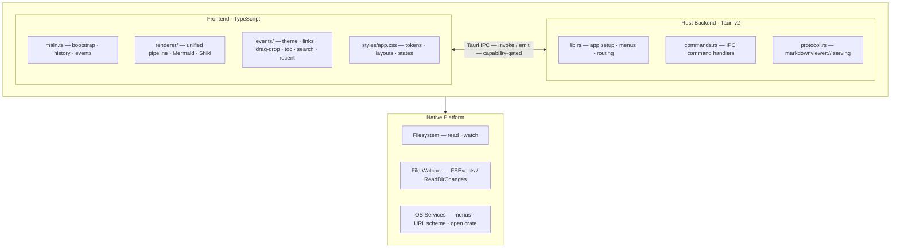

# MarkdownViewer — Product Summary

**Fast, offline-first desktop markdown viewer with native diagram and code support.**

MarkdownViewer renders GitHub-flavored Markdown beautifully — including Mermaid diagrams and syntax-highlighted code blocks — without sending your files to any server. Built with Tauri v2 (Rust + WebView), it runs natively on macOS and Windows with a small memory footprint and instant cold start.

Open a file once and the view stays current: MarkdownViewer watches for saves and re-renders automatically, with any editor. Navigate your documentation the way it was meant to be read — follow relative links between files, jump to anchored headings, go back with a keyboard shortcut.

---

## Who It's For

| Audience | Why MarkdownViewer |
|---|---|
| **Engineers** | Preview READMEs, ADRs, and architecture diagrams locally with zero setup — Mermaid renders inline, code is VS Code–quality highlighted |
| **Technical writers** | Live preview that matches what GitHub renders, including callout-style blockquotes and tables — no browser extension, no upload |
| **Teams** | Everyone opens the same file from source control and sees an identical render, offline, without signing in to anything |
| **Anyone** | Drop a `.md` file on the window and it opens instantly — no account, no cloud, no waiting |

---

## Key Features at a Glance

| Category | What you get |
|---|---|
| **Markdown** | Full GFM — tables, task lists, strikethrough, autolinks, footnotes, raw HTML passthrough |
| **Diagrams** | All Mermaid v11 types: flowchart, sequence, class, ER, state, Gantt, git graph, pie, mindmap, timeline, and more |
| **Code** | Syntax highlighting for 100+ languages via Shiki — VS Code token colors, light and dark palettes |
| **Images** | Relative-path local images with loading skeleton and broken-image placeholder |
| **File opening** | Menu (Cmd+O), drag-and-drop, Finder double-click, CLI argument, deep link URL, Recent Files submenu |
| **Live reload** | Automatic re-render on every save — works with any editor, including atomic-save editors (VS Code, Vim, JetBrains) |
| **Navigation** | Back/Forward history (Cmd+[ / Cmd+]), relative `.md` link following, anchor scroll, external link preview tooltip |
| **Table of Contents** | Floating TOC panel with scroll-spy; H1–H6 hierarchy; click-to-jump; toggle with Cmd+Shift+T |
| **In-document Search** | Cmd+F; real-time match highlighting; match count; next/previous navigation; Escape to close |
| **Recent Files** | Last 10 opened files in File → Open Recent; persists across restarts |
| **Theme** | Follows OS appearance; manual override to Light, Dark, or System; zero flash on startup or switch |
| **Persistence** | Window position, size, theme preference, TOC visibility, and recent files restored on every relaunch |
| **Security** | Fully offline; no telemetry; path traversal guards at every file entry point; strict CSP |

---

## Feature Details

### GitHub-Flavored Markdown

MarkdownViewer renders the complete CommonMark spec plus every GFM extension:

- **Tables** with left, center, and right column alignment
- **Task lists** (`- [ ]` / `- [x]`) with correct checkbox rendering
- **Strikethrough** (`~~text~~`)
- **Autolinks** — bare URLs become clickable links automatically
- **Footnotes** — superscript references with linked footnote section
- **Raw HTML passthrough** — `
/
`, `<kbd>`, `<mark>`, and other standard HTML elements embedded in markdown render as expected

Dangerous elements — `<script>`, `on*` event handlers, `javascript:` and non-image `data:` URIs — are always stripped regardless of the source file. There is no "trust this file" mode.

> **For engineers:** The pipeline uses the `unified` / `remark` / `rehype` ecosystem. The processor is built once and frozen with `processor.freeze()` at module load — repeated renders are allocation-free in the plugin chain. Per-render state (the file's `basePath`) is threaded through `VFile.data` rather than plugin options, so the frozen processor stays safely reusable.
>
> Pipeline order: `remarkParse` → `remarkGfm` → `remarkRehype` (`allowDangerousHtml`) → `rehypeRaw` → `rehypeExtractMermaid` → `rehypeResolveImages` → `rehypeSlug` → `rehypeSanitize` → `rehypeShiki` → `rehypeStringify`.
>
> A final `DOMPurify` pass runs after `innerHTML` injection as defense-in-depth — `rehypeSanitize` already cleaned the AST, but this catches any edge case from `rehype-raw` or future plugin interaction.
>
> See [Markdown Parser decision](./architecture.md#markdown-parser-remarkunified) for why `remark` was chosen over `markdown-it` (structural delimiter disambiguation, source positions).

---

### Mermaid Diagrams

All Mermaid v11 diagram types render as inline SVG directly in the document. Diagrams switch between light and dark themes instantly when the app's theme changes — no page reload, no source re-read.

**Supported types:** flowchart, sequence, class, state, entity-relationship, Gantt, git graph, pie, user journey, mindmap, timeline, quadrant chart, XY chart. Unknown or future diagram types show a neutral placeholder instead of crashing.

> **For engineers:** Mermaid blocks are extracted from the rehype AST **before** Shiki runs (by `rehypeExtractMermaid`). Shiki skips `pre.mermaid-source` by class — preventing a double-processing conflict. Mermaid renders **after** the HTML is in the DOM so it can measure containers and produce correctly sized SVGs.
>
> SVG output is sanitized with a custom DOM-based sanitizer — not DOMPurify. DOMPurify's namespace validation strips HTML-namespace children (`div`, `span`, `p`) out of SVG-namespace `<foreignObject>`, which is exactly how Mermaid v11 renders node labels. The custom sanitizer parses via `div.innerHTML` (correct HTML5 content-mode switching), removes `<script>` elements and `on*` / `javascript:` / non-image `data:` URI attributes in-place, and transfers nodes into a `DocumentFragment` without re-serializing.
>
> `securityLevel: 'loose'` is required for inline SVG (vs iframe). The post-render sanitizer compensates for the reduced Mermaid-internal security.
>
> Diagram source strings are stored in `figure.dataset.mermaidSrc` — theme changes re-render diagrams in-place without re-reading the file.
>
> See [Diagram Renderer decision](./architecture.md#diagram-renderer-mermaidjs).

---

### Syntax-Highlighted Code

Fenced code blocks render with VS Code–quality syntax highlighting via Shiki. Over 100 languages are supported. Both `github-light` and `github-dark` token palettes are embedded in the bundle — no network request, no flash on theme switch, no re-render.

Wide code blocks scroll horizontally rather than overflowing the viewport.

> **For engineers:** Shiki emits CSS custom properties (`--shiki-light`, `--shiki-dark`) as inline `style` attributes on each ``. The active palette is selected purely by the presence of `html.dark` on the document element — zero JavaScript re-render on theme change. The `style` attribute is allow-listed on `` and `<pre>` specifically in `sanitize.ts` — not globally — to prevent markdown authors from injecting arbitrary styles on other elements.
>
> See [Syntax Highlighter decision](./architecture.md#syntax-highlighter-shiki).

---

### Local Images

Images referenced with relative paths resolve from the directory of the open file — the same way GitHub renders them. While loading, a skeleton placeholder appears. If the file is missing or fails, a broken-image placeholder appears with the path as a hover tooltip.

> **For engineers:** Relative `src` values are rewritten to `markdownviewer://{resolved-path}` by the `rehypeResolveImages` HAST plugin. The rewrite includes a `startsWith(basePath)` traversal guard — images outside the open file's directory tree are rejected before the request reaches Rust.
>
> The Rust URI scheme handler (`app/src/protocol.rs`) receives every request, calls `canonicalize()` to resolve symlinks and reject traversal at the OS level, checks `is_file()`, and validates the extension against an allowlist (png, jpg, jpeg, gif, webp, svg, avif, bmp, tiff, ico). `file://` is intentionally never used — it would give untrusted markdown content unrestricted filesystem read access.
>
> The handler sets `Cache-Control: no-store` and `X-Content-Type-Options: nosniff` on every response.

---

### File Opening

MarkdownViewer accepts files from every standard entry point:

| Method | How |
|---|---|
| **Menu / keyboard** | File → Open File… or Cmd+O |
| **Drag and drop** | Drop any `.md` or `.markdown` file onto the window — if no document is open it loads immediately; if one is open, a native confirmation dialog appears |
| **Finder double-click** | Registered as an "Open With" handler; can be set as the system default viewer for `.md` files |
| **CLI** | `MarkdownViewer /path/to/file.md` |
| **Deep link** | `open "markdownviewer:///path/to/file.md"` from Terminal or any other app |

> **For engineers:** All entry points funnel through `safe_markdown_path` / `canonical_markdown_path` in Rust before any path reaches the frontend. These functions call `fs::canonicalize` (resolves symlinks, rejects traversal and non-existent paths) and enforce the `.md` / `.markdown` extension check.
>
> The deep link scheme (`markdownviewer://`) is registered in `tauri.conf.json` under `plugins.deep-link.desktop.schemes` — Tauri bundles write `CFBundleURLTypes` to the macOS Info.plist automatically. The `path_from_deep_link` parser requires the canonical 3-slash form (`markdownviewer:///path`) and rejects non-empty authority to prevent hostname injection.
>
> File opens from Finder while the app is already running arrive via `RunEvent::Opened { urls }` (the macOS `application:openURLs:` Apple Event) and follow the same validation path. The single-instance plugin forwards additional CLI opens to the already-running instance via `app.emit("open-file", ...)`.
>
> The drag-drop overlay uses Tauri's `tauri://drag-enter` / `tauri://drag-leave` / `tauri://drag-drop` events. Only `.md` / `.markdown` paths trigger the overlay — other file types are silently ignored.

---

### Live Reload

The rendered view updates automatically within milliseconds of the file being saved — with any editor. There is no polling; the OS notifies MarkdownViewer directly.

> **For engineers:** File watching uses the `notify` crate — FSEvents on macOS (kernel-level, zero polling latency), ReadDirectoryChangesW on Windows. Atomic saves (the write-then-rename pattern used by VS Code, Vim `writebackup`, JetBrains IDEs) produce a `Modify(Name(_))` event. The handler checks `Path::is_file()` on the watched path to distinguish "renamed over" (new content → `file-changed`) from "renamed away" (file gone → `file-deleted`).
>
> Only one watcher is kept alive at a time in a `Mutex<Option<RecommendedWatcher>>` in `WatcherState`. Replacing it by storing a new watcher automatically drops — and stops — the previous one. Auto-reload sets the `navigatingHistory` flag before calling `loadFile` so the reload does not push a duplicate entry onto the history stack.

---

### Navigation

Navigate your documentation without leaving the app:

- **Back / Forward** — Cmd+[ and Cmd+] (or Go menu) move through the file history stack, exactly like a browser
- **Relative `.md` links** — clicking a link like `[architecture](./architecture.md)` opens the linked file and pushes it onto the history stack
- **Anchor links** — `#section` links scroll smoothly to the target heading within the current document
- **External links** — always open in the system default browser; hovering shows a small URL preview tooltip after 450ms
- **Heading anchors** — every heading gets an `id` attribute so any `#fragment` URL can link directly to it

> **For engineers:** The history stack is an in-memory `string[]` in `main.ts`. Every new file open calls `pushHistory(path)` and truncates the forward stack. A `navigatingHistory` flag suppresses the push during back/forward and auto-reload. The Go menu's Back/Forward items are enabled/disabled from the frontend via the `sync_nav_menu` Tauri command.
>
> In Tauri v2, `AppHandle::menu().get(id)` only searches root-level items — not nested submenu children. `nav-back` and `nav-forward` live inside the Go submenu, so `sync_nav_menu` iterates `menu.items()` → each `Submenu::items()` explicitly.
>
> Relative MD links are resolved using `resolveMdPath` in `ui/events/links.ts`, which normalizes `..` segments then checks `result.startsWith(base)` to reject traversal outside the open file's directory tree.

---

### Floating Table of Contents

A collapsible sidebar panel lists all headings (H1–H6) in the current document, with scroll-spy highlighting to show which section is currently in view.

- **Toggle:** View → Table of Contents or `Cmd+Shift+T`
- **Click to jump:** clicking any TOC entry scrolls to the corresponding heading
- **Scroll-spy:** the currently visible heading is highlighted automatically as you scroll — only one entry highlighted at a time
- **Floating overlay:** the panel floats over the document (does not push the layout), positioned top-right
- **Persistence:** panel visibility is saved in localStorage and restored on relaunch
- Documents with no headings show an empty panel with a "No headings found" message

> **For engineers:** Headings are extracted from the rendered DOM after each `loadFile` call — not from the markdown AST — by `updateToc()` in `ui/events/toc.ts`. Extraction uses `document.querySelectorAll('.markdown-body h1, h2, h3, h4, h5, h6')` and preserves heading level for visual indentation.
>
> Scroll-spy uses `IntersectionObserver` with `rootMargin: '-10% 0px -85% 0px'`, which creates a horizontal band near the top of the viewport. Only the heading that crosses into this band is marked active — at most one entry highlighted at a time.
>
> The TOC panel visibility is class-based (`#toc.toc-visible`) rather than the HTML `hidden` attribute. WKWebView's author stylesheet overrides the UA-level `[hidden] { display: none }`, making attribute-based toggling unreliable. The `#app.toc-open` class adjusts the document margin when the TOC is open.
>
> The native menu checkmark (View → Table of Contents) is synced via the `sync_toc_menu` Tauri command on startup and after each toggle. `sync_toc_menu` uses `menu.get("toc-toggle")` which reliably finds `CheckMenuItem` nodes.

---

### In-document Search

A floating search bar (`Cmd+F`) finds and highlights text within the rendered document in real time.

- **Open:** `Cmd+F` or Edit → Find in Document — positioned top-right, floating above content
- **Real-time highlighting:** all matches are highlighted as you type; a count shows as "3 of 12 matches"
- **Navigate matches:** `Enter` or `↓` for next, `Shift+Enter` or `↑` for previous; current match has a distinct accent color, others have a lighter tint
- **Close:** `Escape` or click outside — clears all highlights
- **Case-insensitive** by default; matches inside headings, tables, code blocks, and callouts
- Mermaid diagram SVG content is excluded (it is not human-readable text)
- No results: the bar shows "No matches" — no error thrown

> **For engineers:** Search is implemented in `ui/events/search.ts` using the `mark.js` library. `mark.js` handles partial matches that span DOM node boundaries cleanly — unlike `window.find()`, which cannot count matches or style them individually.
>
> All marks are applied to the `.markdown-body` container via a shared `Mark` instance. Navigation collects all `.mark` elements and calls `scrollIntoView` on the active one. The search bar is shown and hidden via a CSS class (`#search-bar.search-open`), not the `hidden` attribute, for WKWebView compatibility.
>
> `Cmd+F` is handled in the renderer process as a `keydown` listener — no global shortcut registration needed, since search only applies to the focused window. The `find-in-doc` Tauri event is also emitted by the Edit → Find in Document menu item.
>
> When the search bar is open, an `#app.search-active` class shifts the TOC panel down by `3.5rem` to prevent overlap.

---

### Recent Files

The last 10 opened files are available under File → Open Recent for quick access.

- **Most-recently-used first:** the most recently opened file appears at the top of the submenu
- **Shortened paths:** each entry shows the filename with an abbreviated parent path (e.g., `README.md  ~/Documents/project`)
- **Missing files:** entries for files that no longer exist are shown grayed out (disabled); clicking them would show "File not found" and remove the entry from the list
- **Current file excluded:** the currently open file is not shown in the recent list while it is already open
- **Clear:** "Clear Recent Files" at the bottom of the submenu clears the entire list
- **Persists:** the list survives app restarts via localStorage

> **For engineers:** The list is stored as a JSON array in `localStorage['markview-recent']`. `ui/events/recent.ts` owns all read/write operations — `addToRecent`, `removeFromRecent`, `clearRecent`, and `syncRecentMenu`.
>
> The native "Open Recent" submenu is rebuilt by the `sync_recent_menu` Tauri command (in `commands.rs`) on every file open, file close, and startup. This command is `async` — all Tauri menu APIs (`remove_at`, `append`, `MenuItem::with_id`) dispatch to the main thread internally via `run_main_thread!`. A sync command running on the main thread would deadlock waiting for itself.
>
> Menu item IDs embed a generation counter: `rf-{gen}-{idx}` for existing files, `rfc-{gen}` for the Clear button. Every rebuild increments the counter so re-created items never collide with IDs still registered in Tauri's global ID registry from the previous build.
>
> Clicking an existing entry emits `open-recent-file` from Rust → frontend. If `loadFile` fails (stale path), `removeFromRecent` prunes the entry and `syncRecentMenu` rebuilds the native submenu.

---

### Light / Dark Theme

MarkdownViewer follows the OS appearance setting by default and switches instantly — no restart, no flicker. Prose, code blocks, Mermaid diagrams, and all UI chrome update together.

**Manual override** is available under View → Theme:

| Setting | Behavior |
|---|---|
| **System** (default) | Follows the OS — switches automatically when macOS / Windows appearance changes |
| **Light** | Pinned to light mode regardless of OS setting |
| **Dark** | Pinned to dark mode regardless of OS setting |

The active choice is shown with a checkmark in the menu and persists across relaunches. Switching takes effect immediately.

> **For engineers:** Theme preference is stored in `localStorage['markview-theme']` (values: `'light'` | `'dark'` | `'system'`). An inline synchronous `<script>` in `<head>` reads this key and adds `html.dark` to the document element before any CSS renders — eliminating the flash of unstyled content (FOUC) on startup.
>
> OS preference changes fire `window.matchMedia('(prefers-color-scheme: dark)').addEventListener('change', ...)` in `ui/events/theme.ts`, but only when the preference is `'system'`; manual overrides suppress OS events entirely.
>
> On a theme change, code block colors switch via CSS custom property (`--shiki-light` / `--shiki-dark` toggled by `html.dark`) — no JS re-render. Mermaid diagrams must be fully re-rendered because SVG colors are baked in at render time; `figure.dataset.mermaidSrc` provides the original source for in-place re-render without re-reading the file.
>
> The native menu checkmarks are synced on startup via the `sync_theme_menu` Rust command, which updates the three `CheckMenuItem` items in the View → Theme submenu to match the persisted localStorage value.

---

### Session Persistence

On relaunch, MarkdownViewer opens at exactly the same window size and position as when it was last closed — even after a monitor configuration change. The theme preference (System / Light / Dark) is also restored.

> **For engineers:** Window bounds are managed automatically by `tauri-plugin-window-state`. The plugin validates restored bounds against available displays and resets to centered if the saved position is off-screen (e.g., after disconnecting a secondary monitor). Theme preference persists via `localStorage` as described above. No additional persistence layer is needed for the current feature set.

---

## Security

MarkdownViewer is designed to be safe to open untrusted markdown files from the internet.

**What it never does:**
- Makes network requests (the WebView's CSP blocks outbound connections)
- Sends telemetry or usage data
- Passes file paths or content to external services
- Executes `<script>` tags or `on*` event handlers from markdown

**What protects you:**

| Layer | What it does |
|---|---|
| Rust path validation | Every path from any source (drag-drop, CLI, deep link, IPC) goes through `fs::canonicalize` + extension check before any filesystem operation |
| `markdownviewer://` protocol | Local images served through a custom URI handler with allowlisted extensions and path traversal rejection — `file://` is never used |
| `rehypeSanitize` | Strips disallowed HTML from the rendering AST before stringification |
| DOMPurify | Final DOM-level pass after `innerHTML` injection — defense-in-depth against pipeline edge cases |
| Custom SVG sanitizer | Post-Mermaid DOM walk: removes `<script>`, `on*` attributes, `javascript:` and non-image `data:` URIs |
| Tauri capabilities | Frontend is granted only the minimum IPC surface via `app/capabilities/default.json` — no `fs` or `shell` permissions |

> **For engineers:** See [`architecture.md`](./architecture.md) for the full security model, including path validation flow, sanitization layers, CSP policy, and the `markdownviewer://` protocol handler design.

---

## Architecture Summary

*For mid-level engineers evaluating or contributing to the codebase.*

**Key architectural properties:**

- The frontend has no direct filesystem access — all reads go through `read_file` / `watch_file` Tauri commands
- Every path received from the frontend is re-validated in Rust before use (`canonical_markdown_path`)
- The WebView's CSP prevents arbitrary network requests and script injection
- The unified processor is frozen at module load — rendering is stateless and safe to call from any event handler

**Source layout:**

| Path | Contents |
|---|---|
| `ui/main.ts` | App bootstrap, event listeners, history stack, `loadFile` |
| `ui/renderer/pipeline.ts` | Frozen unified processor, all rehype plugins |
| `ui/renderer/mermaid.ts` | Mermaid init, render, theme re-render, SVG sanitizer |
| `ui/renderer/sanitize.ts` | `sanitizeOptions` extending `rehypeSanitize` defaultSchema |
| `ui/events/theme.ts` | Theme detection, preference persistence, OS change listener |
| `ui/events/links.ts` | Click delegation — anchor scroll, external open, MD navigation |
| `ui/events/drag.ts` | Native drag-drop overlay and file-open handler |
| `ui/events/toc.ts` | TOC panel — build from DOM, scroll-spy via IntersectionObserver, toggle, persistence |
| `ui/events/search.ts` | In-document search — mark.js integration, match navigation, open/close |
| `ui/events/recent.ts` | Recent files — localStorage read/write, native submenu sync |
| `ui/styles/app.css` | App chrome, image states, Mermaid states, drag overlay, TOC panel, search bar |
| `app/src/lib.rs` | Tauri app setup, menu construction, event routing |
| `app/src/commands.rs` | All `#[tauri::command]` handlers |
| `app/src/protocol.rs` | `markdownviewer://` URI scheme — secure local file serving |

---

## System Requirements

| Platform | Minimum OS | Runtime |
|---|---|---|
| macOS | 10.13 High Sierra | WKWebView built-in — no extra runtime |
| Windows | Windows 10 | WebView2 Runtime (ships with Windows 11; free install on Windows 10) |

**Typical resource usage:** 50–90 MB RAM at rest. Cold start under 1 second on modern hardware.

---

## Keyboard Shortcuts

All shortcuts available in the current release.

| Shortcut | Action |
|---|---|
| `Cmd+O` | Open file |
| `Cmd+W` | Close current file |
| `Cmd+[` | Navigate back |
| `Cmd+]` | Navigate forward |
| `Cmd+F` | Find in document |
| `Cmd+Shift+T` | Toggle Table of Contents |

For planned shortcuts (Cmd+K, Cmd++/−/0, and more), see [Planned Keyboard Shortcuts](./unimplemented.md#planned-keyboard-shortcuts).

---

## Further Reading

- [Architecture](./architecture.md) — deep-dive: rendering pipeline, security model, IPC reference, file watching, theme system
- [Technology Decisions](./architecture.md#technology-decisions) — full rationale for every major technology choice
- [Unimplemented Features](./unimplemented.md) — open gaps and implementation guides for contributors
- [Backlog (P3–P7)](./unimplemented.md#backlog-overview) — prioritized future feature pipeline
